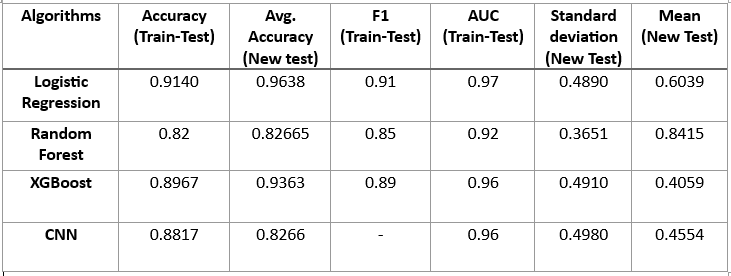

There will be both Turkish and English outlines (maybe japanese as well in near future?) to explain what we have achieved and performed in our project. it won't be in an instant because I am a bit sluggish and unwilling to do something.
# Yergili Haber Tespiti (Türkçe)
Bir mezuniyet projesi adı altında yoldaşlarımla birlikte beraber açtığımız ve tamamladığımız Machine Learning ve Deep Learning teknikleriyle çalışan bir model girişimidir. Amacımız başlıkta belirtildiği gibi Türkiye de gerek gerçek ile alaycı sahte haberleri ayırt etmekte yardımcı olacak bir Makine öğrenmesi modeli yaratmaktır. Verisetimiz, Twitter üzerinden birçok haber kanalına ait olan twit haberlerinden [snscrape](https://github.com/JustAnotherArchivist/snscrape)  adlı tool kullanılarak toplanıp derlenmiştir. Merak edenler için twitter hesap adları verisetleri içinde bulunmaktadır.hangi algoritmaları kullandığımızı gösteren kısa bir listemiz olacaktır. 

1.Random Forest 
2.Logistic Regression 
3.Xgboost 
4.CNN 

Ve elbette bunların verdiği sonuçların doğruluğunu ölçmemiz için kullanılan parametrelerle birlikte sonuçları gösteren tablomuz aşağıdaki gibidir. 
(:1:)"train-test":Eğitimde kullanılan veriseti değerlerinin tahmin doğruluk oranı 
(:2:)"new test":Verisetinde bulunmaayan ve sonradan toplanmış,toplamda 300 adet twitter yazısının modelin tahmin doğruluk oranı 

